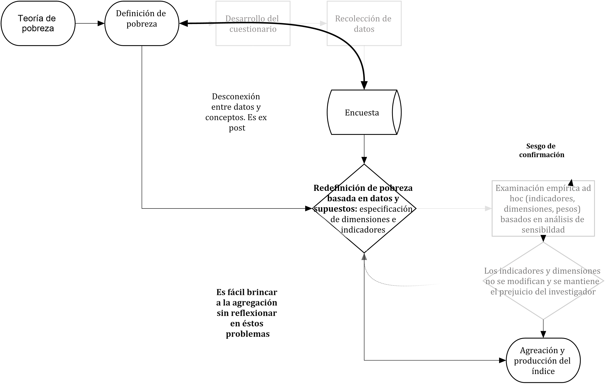
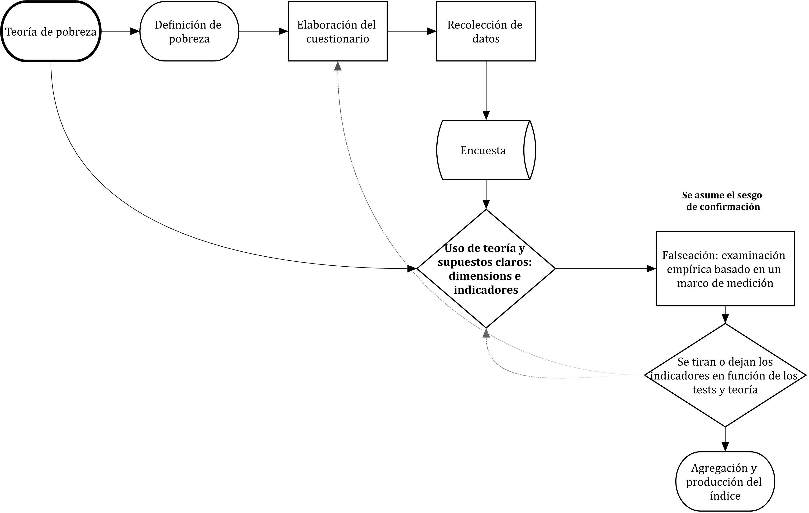
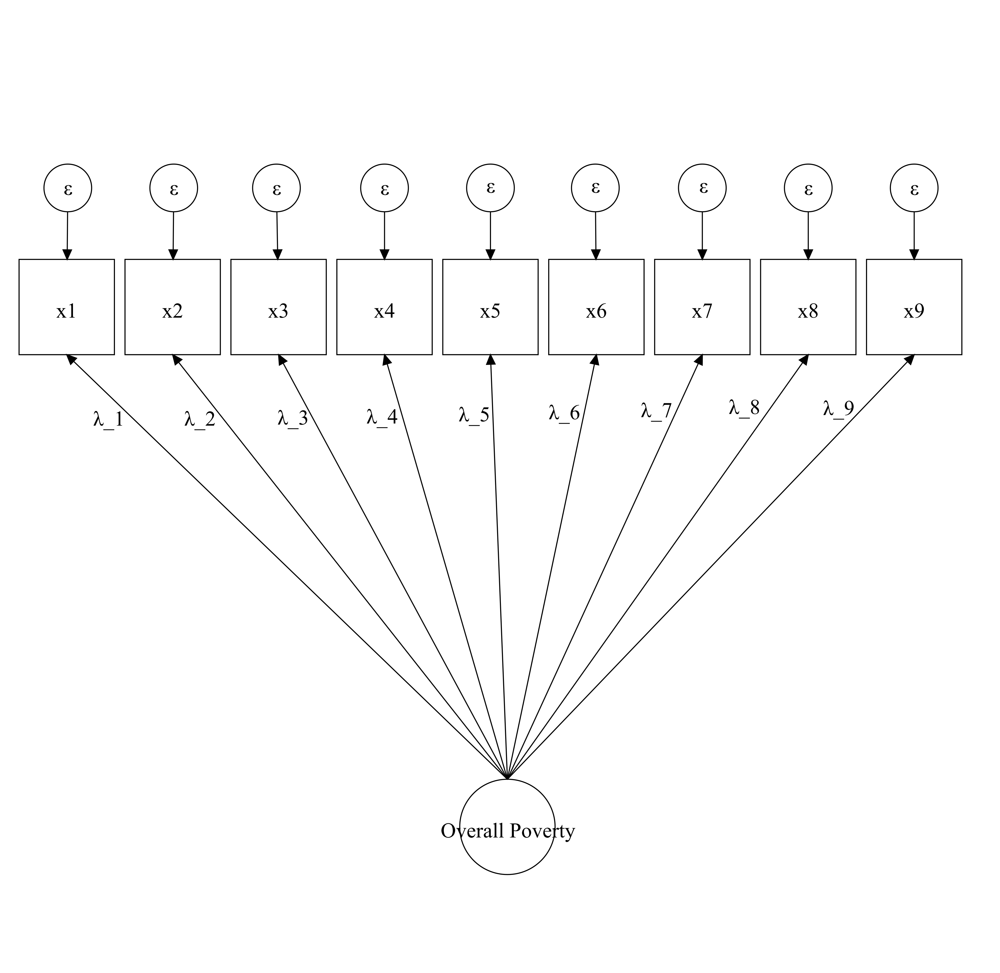
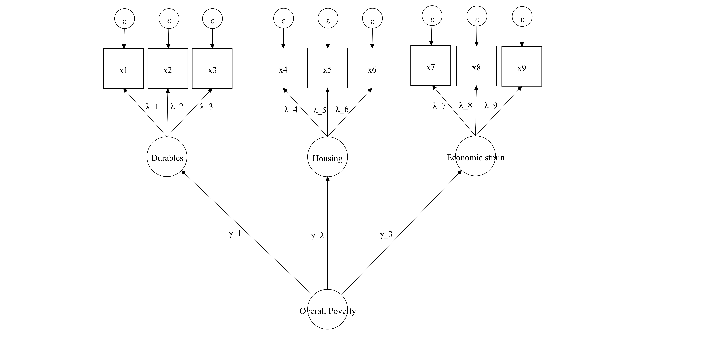
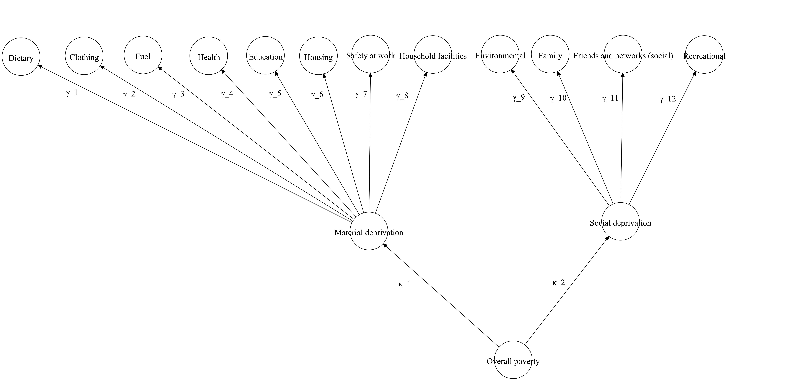

# Pobreza y teoría de la medida: Un marco estadístico {#Chapter-2}


**Resumen**

Este capítulo propone un marco estadístico para enfrentar algunos de los retos actuales en la medición multidimensional de la pobreza. El marco se basa en la teoría de la medida y se propone para el diseño y escrutinio empírico de los supuestos clave en la producción de medidas multidimensionales de pobreza. El capítulo parte de la ruta crítica para producir medidas científicas y posteriormente introduce los principios de **confiabilidad, validez, medición invariante y equivalización de escalas**, mismos que serán definidos y desarrollados en el resto del libro. 

## Ruta crítica para medición multidimensional de pobreza

El capítulo 1 esbozó algunas de las tareas fundamentales en el desarrollo y producción de índices multidimensionales de pobreza y subrayó el tipo de supuestos que los investigadores tienen que levantar en cada etapa: número de dimensiones, indicadores y umbrales, pesos de indicadores y dimensiones, agregación y producción del score de privación y la especificación de la línea de pobreza (@Alkire2007; @Thorbecke2007 y @Gordon2012). 

La Figura \@ref(fig:realwf) ilustra la estrategia que regularmente, en la práctica, siguen los investigadores para producir un índice de pobreza. Esta estrategia no es idea porque generalmente la medición precede a los datos (la información está dada). Por tanto, los investigadores tienen poca influencia sobre el proceso de recolección de datos y, por tanto, tienen que adaptarse a la información existente sobre privación observada y reformular su definición de pobreza -incluso en los peores casos, ellos tienen que adaptar la definición a los datos-. En una siguiente etapa se levantan una serie de supuestos sobre los contenidos de la medida -dimensiones, indicadores, pesos y línea de pobreza- (see [Chapter 1](#Chapter-1). Idealmente, estos supuestos deberían examinarse usando un marco claro de medición, pero en la práctica los investigadores evaden o ignoran esta etapa. En otros casos, realizan una serie de análisis ad hoc de sensibilidad. La limitación es que este tipo de escrutinio no parte de una hipótesis clara y los investigadores corren el riesgo de confirmar sus prejuicios por falta de una estrategia clara de falseo. El sesgo de confirmación, por tanto, tiene mayor probabilidad de permanecer, así como la validación empírica a desdibujarse. Los investigadores, por tanto, pueden dar un salto de la medida propuesta desde la teoría al proceso de agregación. 

```{r realwf, echo=FALSE, message=FALSE, fig.cap=c("Flujo de trabajo que regularmente se sigue en la medición de pobreza"), message=FALSE}

```

La medición científica demanda una relación clara entre teoría, conceptos, datos y un marco claro para falsear los supuestos del investigador. La Figura \@ref(fig:idealwf) muestra la ruta crítica para que los investigadores puedan reducir el riesgo de sesgos de confirmación y error en la medición. Primero, los conceptos adquieren significado a través del marco teórico utilizado para su definición. Es decir, el concepto debe estar anclado en una teoría clara de pobreza. Segundo, la definición de pobreza debe ser científica en el sentido de que sus contenidos sean verificables de alguna manera [Capítulo 1](#Chapter-1). Posteriormente, la definición y teoría en cuestión debe utilizarse para diseñar un cuestionario para colectar datos que están pensados para medir pobreza. Los investigadores pueden entonces especificar el tipo de modelo o estructura de la medida de pobreza. Es decir, el número de dimensiones, indicadores, etc. Una vez que se tengan tanto los datos como la especificación, se pueden falsear los supuestos usando un marco estadístico adecuado. Los resultados de este proceso pueden utilizarse para pulir la medida en un proceso iterativo -apegado a la teoría-. Una vez que la medida sea robusta (usando como criterios los del marco de medición adoptado), los investigadores pueden agregar los indicadores y a identificar al grupo pobre y no pobre. 

```{r idealwf, echo = FALSE, message=FALSE, fig.align='center', fig.cap="Flujo de trabajo que debería seguirse en la medición de pobreza", fig.pos='H'}

```

Esta ruta crítica para producir medidas de pobreza permite identificar la relación entre teoría, datos y métodos de evaluación. Estos tres aspectos, al final, son esenciales en cualquier programa de investigación científico. Una forma útil y factible de avanzar de forma ordenada en el análisis empírico de medidas de pobreza consiste en detectar los supuestos que levantamos y reconocer sus implicaciones. Una vez hecho esto es posible pasar a un marco falsable de medición. Esto significa, levantar preguntas sobre todos los supuestos y proponer un método que busque responder si las ideas del investigador se sostienen dados los datos. 

Los retos de la medición multidimensional de pobreza pueden ponerse en términos de etapas secuenciales. De hecho, estos elementos son parte de un esfuerzo que busca aproximar la prevalencia e identificación de pobreza y pueden escribirse en términos de un modelo estadístico. Es decir, vamos a comenzar a poner los supuestos y reto de la medición en términos de un modelo que tenga una contraparte estadística. Este modelo no es más que una versión más simple e imperfecta de la pobreza que tiene reflejo en los datos observados. Como plantea @McCullagh2002, la idea de un modelo estadístico parte del reconocimiento de que la caracterización de un fenómeno es simplemente una aproximación. Como tal, un modelo para medir pobreza es una opción que puede y necesitar evaluarse y mejorarse. Antes de decir cómo un modelo de pobreza puede examinarse y mejorarse, es importante presentar un marco explícito que permita posicionar nuestros supuestos de forma falsable. 


### Identifiación del espacio de muestreo {#samplingspace}

Es un poco extraño pensar en muestreo en medición porque lo relacionamos con encuestas y recolección de datos en campo. Sin embargo, en medición el concepto de muestreo de información es muy importante. Uno de los aspectos ignorados en medición de pobreza es que los investigadores nunca trabajan con información completa. Esto no se refiere a uso de datos censales sino a la información perfecta para producir un índice. La razón principal es que el conjunto de indicadores perfectos para medir pobreza se desconoce o no está disponible. Dada una definición de pobreza, hay diferentes dimensiones, indicadores y parámetros para producir un modelo que aproxime vía datos el nivel individual de severidad de pobreza. 

Las opciones de dimensiones, indicadores, pesos y umbrales pertenecen a un espacio desconocido pero ideal que incluye todas las opciones. Este es un aspecto crucial en medición de pobreza y subraya el hecho de que hay un supuesto general en medición (basado en teoría o datos) sobre qué subconjuntos tienen mayor probabilidad de medir con poco error pobreza. 

1. Espacio de muestreo de todos las dimensiones posibles $\mathscr J$
2. Espacio de muestreo de todos las variables $\mathscr X$
3. Espacio de muestreo de todos los parámetros posibles (e.g. pesos) $\Theta$

Estos espacios entonces nos llevan a imaginar el modelo ideal para medir pobreza y que puede escribirse de manera compacta como: 

\begin{equation}
(\#eq:mainmodel)
\mathscr F = \{\mathscr X, F_{\theta} : \theta \in \Theta\}
\end{equation}

donde las variables $x_1,...,x_n$ siguen cierta distribución $F_{\theta}$, la cual se indexa a un parámetro $\theta$ definido en el espacio de los parámetros  $\Theta$. $\mathscr F$ es una familia de distribución de probabilidad, del conjunto completo de datos $\mathscr X$. Con las muestras que obtenemos de cada espacio aspiramos a tener una probabilidad $\approx1$ de identificar al grupo pobre. 

### Selección de indicadores y dimensiones

La medición de la pobreza es un ejercicio de muestreo de diferentes espacios- conjunto de opciones. Por ejemplo, se ponen por delante algunas dimensiones, indicadores y pesos que se piensa provienen del espacio de pobreza. Esta selección es el primer reto en medición de pobreza donde los investigadores eligen las dimensiones $j$ de $\mathscr J$, indicadores $x_{ij}$ de $\mathscr X$, de manera que si la medida tiene 30 indicadores $\mathscr X={1,2,...,30}$ donde $x_{ij}=1$ cuando hay privación y $x_{ij}=0$ cuando no la hay (y $z>0$ para variables binarias). Para variables nominales, hay un espacio de umbrales posibles $\mathscr Z$.

La selección de dimensiones, indicadores y umbrales implica asumir que el muestreo que hacemos es el mejor posible, es decir, es aquel que nos lleva a una buena medida de pobreza. Esto lleva a preguntarse lo siguiente: ¿Cómo sabe el investigador que su muestreo está equivocado? Esta interrogante pude separarse en dos preguntas: 

* Es el subconjunto de dimensiones $j$ de $\mathscr J$ una carecterización *adecuada* de pobreza? 
* Es el subconjunto de indicadores, dado un umbral $(X;z)$ de $\mathscr X$  una caracterización *adecuada* de pobreza? 

La palabra *adecuada* es un término vago en este punto. Necesitamos una teoría clara o estándar para definirla. Esto se cubre en la siguiente sección, pero en este momento nos enfocaremos en traducir con mayor precisión los retos de la medición de pobreza en supuesto dentro de un modelo estadístico, que después pueda testearse de alguna manera. 

### Agregación de indicadores y estructura de pesos 

Los primeros supuestos se enfocan en la selección de indicadores y dimensiones. Como se discutirá más adelante, en esta etapa un marco falsable es muy útil pero extrañamente ha estado ausente en la investigación de pobreza. En la ruta crítica *real* de la medición de pobreza es común observar un salto de lis indicadores seleccionados a la agregación. El uso que normalmente se le da al método AF de agregación ilustra el problema de la falta de escrutinio. 

Una vez que se han seleccionado los indicadores y dimensiones, el método AF se utiliza para agregarlos. Este método producirá buenos resultados si los indicadores seleccionados resultan en una caracterización *adecuada* de pobreza. Sin embargo, no hay nada dentro del método AF que nos asegura que este es el caso. Esto no es una deficiencia del método, sino de la ausencia de un escrutinio empírico claro. En cambio, lo que tiende a pasar es que se asignan pesos $w \in \mathscr W$, donde $w_{ij}=1$ para medidas con pesos no diferenciales y $w_{ij}\ne 1$ para medidas con pesos diferenciales. Una vez asignados los pesos, se procede con la agregación

La secuencia, un tanto extraña, de redacción del párrafo anterior es totalmente intencional. Uno de los problemas actuales en medición de pobreza es la sobre preocupación con los pesos y la despreocupación que hay por las propiedades de los indicadores y dimensiones que se incluyen en una medida. Por teoría de la medida (ver [Capitulo ](#Chapter-3)), se sabe que los pesos diferenciales son solamente útiles cuando se tiene una medida que tiene mucho ruido puesto que ayudan a corregir los problemas de ordenamiento de la población. Evidentemente, lo que está perdido en esta etapa es el escrutinio del supuesto que levantamos sobre los pesos, llevando a la siguiente pregunta: 

* Los pesos seleccionados llevan a ordenamientos consistentes de la población? 

Esta pregunta debe plantease en términos de ordenamiento porque, al final, lo que hacen los pesos es afectar el valor del score observado de privación y esta medida nos indica la severidad de privación de cada persona. Por tanto, nos gustaría saber si los pesos están o no afectando ese ordenamiento. Como veremos en el [Capitulo ](#Chapter-3) esto tiene que ver con el principio de confiabilidad de la teoría de la medición. 

### División de la población en los grupos pobre y no pobre

La teoría fundamental de pobreza predice que cuando menos existen dos grupos de población: el grupo pobre y no pobre. En el Capítulo [Capitulo](#Chapter-1) se discute el significado que se le da a este grupo. La expectativa que se tiene en medición es que una vez que hemos hecho el muestreo de dimensiones, indicadores, umbrales y pesos -y que tal selección es *adecuada*- se tenga un ordenamiento claro de la población de manera que podamos separarla usando algún criterio para fijar la línea de pobreza. 

Una vez que el modelo de pobreza se ha completado $\mathscr F$ y validado, la agregación produce un score de privación para cada persona en la muestra. En el [Capitulo](#Chapter-1) discutimos las propuestas que existen para fijar la línea de pobreza, pero fundamentalmente estas alternativas buscan producir la mejor separación posible de la población de acuerdo a los dos grupos de interés. Desde el punto de vista estadístico esto significa que, en la mayoría de los casos, los investigadores no hacen más que levantar un supuesto de la mejor separación posible. 

* Cómo saber que nuestro criterio de línea de pobreza es *adecuado*? 

En el [Capitulo](#Chapter-8) se revisa este tema, pero en este punto el énfasis es sobre la necesidad de validar de alguna manera que empíricamente la línea de pobreza que se propone es consistente con la expectativa teórica. 

Con este tercer gran supuesto en medición multidimensional de pobreza, es posible entonces lanzar la siguiente pregunta decisiva: Qué marco nos permite definir si nuestras decisiones son *adecuadas* y qué significa o implica que lo sean? A continuación, revisaremos la relación que tienen todos estos supuestos con la teoría de la medida. 

## La teoría de la medida como marco estadístico para la medición

### Pobreza y error en medición 

En el [Capítulo](#Chapter-1) se subrayó que la pobreza, al igual que otros conceptos en ciencias sociales, es una abstracción. El concepto de pobreza emerge de la idea de que existe un subgrupo de población que tiene un nivel de vida por debajo de lo que la sociedad, en un momento dado, considera como esencial o fundamental para vivir con dignidad. La pobreza, en teoría, impide la participación efectiva en la sociedad e incrementa el riesgo de morir joven, interactúa con varios riesgos sociales, etc. Pero la pobreza es difícil de medir porque no podemos observarla directamente y no podemos describirla con precisión absoluta con una variable. En cambio, la investigación de la pobreza tiene que confiar en datos imperfectos multivariados para ordenar a la población de acuerdo a su nivel de vida. Para hacer las cosas más complicadas, hay varias formas de hacer esta operación puesto que la gente utiliza distintos espacios de muestreo de dimensiones, indicadores, umbrales y pesos. 

El término estadístico de un concepto es *variable latente*. Las variables latentes son constructos que por teoría deberían tener una serie de manifestaciones en el mundo real^[Este no es el único marco. El marco de conjuntos difusos usa el término de vaguedad para describir la imperfección intrínseca a la medición de pobreza [@Martinetti2006]]. En ciencias sociales trabajamos con variables latentes y pobreza es sólo otro caso en el que los investigadores trabajan con un grupo teóricamente construido (no directamente observable) (la gente con depresión, clase social alta, gente inteligente, gente feliz, etc.).

Cómo podemos *detectar* a un grupo de población que proviene de un constructo?  @Spearman1904 puso al frente una idea capital para la medición en ciencias sociales y que tiene que ver con el muestreo de distintos atributos para caracterizar un fenómeno. La teoría de @Spearman1904 señala que **la correlación* que dos o más indicadores de resultado es un síntoma de que ambos probablemente son causados por el mismo fenómeno**. Esta es una primera condición para causalidad. Esto ajusta perfectamente con la teoría que hemos manejado de pobreza [Capítulo](#Chapter-1)]: **La pobreza es falta de recursos en el tiempo y la privación observada es su consecuencia**. El supuesto básico en medición de pobreza es entonces que el conjunto de indicadores de privación ($X \in \mathscr X$) constituye una serie de manifestaciones relevantes/adecuadas de la variable latente pobreza. Este tipo de tratamiento del concepto de pobreza es poderoso porque permite vincular de manera natural la teoría de pobreza con su medición. 

Si juntamos a @Spearman1904 con una teoría de pobreza como la de @Townsend1979 tenemos que: 

> Los indicadores de privación están correlacionados porque tienen la misma causa: pobreza. 

Desde el punto de vista conceptual esto significa que, si el efecto de la pobreza es eliminado, la correlación de las variables sería muy débil o incluso cero. @Spearman1904, padre de la teoría de la medida, postula entonces que el problema del conjunto relevante de indicadores de privación puede enmarcarse desde la perspectiva del *modelo factorial común*. @Thurstone1947, otro de los fundadores de la teoría contemporánea de la medición, propone que este modelo común postula que un indicador observado es función de un factor único, aunque también puede asociarse a otros factores anidados en ese gran factor, es decir, dimensiones. 

La postulación de @Thurstone1947 es fundamental en pobreza porque su idea del factor común resuelve un problema fundamental. En medición de pobreza se toman muestras de lo que pensamos es el espacio de medición ideal. @Thurstone1947 propone que puede haber varias medidas de pobreza que usan distintas muestras. No es un problema usar muestras distintas sino usar muestras del espacio relevante. La implicación es que uno puede tener $n$ índices *adecuados* de pobreza, aunque sus contenidos sean distintos. Esto se debe a que cada privación observada tiene dos fuentes de variación: (1) varianza común y (2) varianza única. El primer tipo es la que determina el factor común. El segundo es la varianza dada por otros factores -que no son pobreza o sus dimensiones- o por error aleatorio. 

## Modelo latente de medición de pobreza

Las raíces del marco de variables latentes se originan en @Spearman1904, @Thurstone1947 y otros [@McALLUM]. El modelo estadístico que se propone desde la teoría de la medida consiste en un modelo factorial común donde cada variables observadas ($x_{ij}$) es producto de una dimensión latente ($\eta_j$) y de un factor de alto orden ($\zeta_h$). Es decir, la pobreza multidimensional tiene una jerarquía, el factor de alto orden es pobreza y los factores anidados son las dimensiones. Uno de los aspectos interesantes de esta formulación es que reconoce explícitamente que no toda la variabilidad de los indicadores observados puede deberse a las variables latentes. Esto es, la teoría de la medida reconoce explícitamente que el error es parte de la medición y puede calcularse. 

\begin{equation}
(\#eq:model1)
 x_{ij} = \lambda_{ij} \eta_j + \varepsilon_ij  
\end{equation}

\begin{equation}
(\#eq:model2)
 \eta_j = \gamma_{j} \zeta  + \xi 
\end{equation}

En este caso $\lambda_{ij}$ y $\gamma_{j}$ se conocen como cargas factoriales y capturan la relación entre las variables latentes y los indicadores de resultado, y entre las dimensiones y pobreza, respectivamente. Por supuesto, es posible tener más $\zeta$'s pero en investigación de pobreza el supuesto es que las dimensiones están anidadas en un factor general (algunos casos especiales se muestran en la Sección \@ref() donde hay un modelo tiene tres niveles):

Pobreza &#8594; Dimensiones &#8594; Sub-dimensiones &#8594; indicadores de resultado. 

Este modelo es una forma de capturar estadísticamente la forma en la que la medición multidimensional de la pobreza se lleva a cabo en la literatura contemporánea. Los investigadores proponen una serie de dimensiones y clasifican los indicadores que proponen de acuerdo con una estructura que puede esquematizarse en un modelo estadístico. El aspecto crucial es que dicha especificación es solo una idea =basada en teoría o datos- sobre cómo pobreza puede medirse mejor desde un punto de vista multidimensional. Esto es, la propuesta es un modelo por validar que demanda algún tipo de escrutinio empírico. Cuando lo ponemos en términos de una ecuación como \@ref(eq:model1) y \@ref(eq:model2), los investigadores se mueven de la especulación teórica hacia falsación empírica. 


## Esquemas y modelos de medición de pobreza 

Los modelos son sólo un esquema de un índice de pobreza que resumen cómo una escala puede construirse. Poner una propuesta teórica en términos de un diagrama ayuda a visualizar y contrastar los distintos planteamientos que se tienen para medir pobreza. La ventaja de la teoría de la medida es que todo puede ponerse en términos de un esquema. Los modelos multidimensionales pueden fácilmente presentarse como un diagrama o esquema, el cuál es una representación gráfica de un modelo. Otra forma de pensar al respecto, es ver a los diferentes esquemas de medición de pobreza como diversas maneras en las que un investigador hace muestrero de $\mathscr J$ y $\mathscr X$. Estos muestreos llevan a diferentes estructuras, es decir, modelos. 

La ecuación \@ref(eq:model1) simplemente resume un modelo en el que una variable latente produce distintos indicadores de resultados ($x_{ij}$). Este modelo es unidimensional porque sólo hay un factor $\eta_j$  como causa de las privaciones observadas. Podemos pensar en este modelo como el **modelo nulo** de medición de pobreza donde los indicadores no pueden ser claramente agrupados en dimensiones. Puede ser el caso de que los indicadores en cuestión midan diversos aspectos de pobreza pero que sean insuficientes para caracterizar a una dimensión. En la práctica, hay pocos modelos teóricos que proponen tal estructura. Empíricamente, sin embargo, es probable que tengamos una medida cuasi-unidimensional por las limitaciones en la recolección de datos y porque raramente ésta viene después de una propuesta teórica (Ver \@ref(Chapter-1)). 

La figure \@ref(fig:cfanull) traduce la ecuación \@ref(eq:model1) en el esquema de una medida unidimensional de pobreza. En la figura podemos ver que la variable latente se representa en círculos y las variables de manifiesto en cuadrados. Esta es la forma convencional de presentar modelos factoriales confirmatorios o, en términos más generales, ecuaciones estructurales. Las flechas apuntan de la variable latente a los indicadores porque se asume que el factor es el fenómeno que causa a las variables observadas. Finalmente, los parámetros que figuran a un lado de cada flecha corresponden a las cargas factoriales. Hemos hablado de que estos parámetros son fundamentales porque son una estimación de la variabilidad explicada por pobreza de cada indicador.  

```{r cfanull, echo = FALSE, message=FALSE, fig.height = 6, fig.width = 5, fig.align='center', fig.cap=c("Representación visual de un modelo unidimensional"), echo=FALSE}

```

La Figura \@ref(fig:cfaguio) muestra más variables latentes. En este caso el factor de alto orden tiene tres dimensiones (tres círculos). Este esquema es la propuesta de @Guio2009 de pobreza multidimensional y representa lo que generalmente tienen los investigadores en mente cuando piensan en una medida multidimensional. Es decir, un agrupamiento en el que los indicadores pertenecen a ciertas dimensiones y las dimensiones son producto del fenómeno pobreza. En este ejemplo, hay 9 indicadores de resultado clasificadas en tres dimensiones ($\eta_j$) (Durables, Housing and Economic strain). Las cargas factoriales ($\lambda_{ij}$) representan la relación de cada indicador con las dimensiones en cuestión. Las flechas del factor de alto orden (pobreza general/Overall Poverty) a cada dimensión son las cargas factoriales ($\gamma_{j}$)  que capturan la relación entre pobreza y cada dimensión. 

Ambos parámetros ($\lambda_{ij}$) y ($\gamma_{j}$)  muestran la fuerza de la relación entre las variables latentes y los indicadores de resultado (Ver \@ref(Chapter-3) sobre el vínculo entre las cargas factoriales, confiabilidad y pesos diferenciales). En este ejemplo hay sólo tres indicadores por dimensión y ninguno de los indicadores pertenece a más de una dimensión. Las medidas de pobreza asumen casi siempre exclusividad, es decir, que los indicadores son manifestaciones de una dimensión.  

```{r cfaguio, echo = FALSE, message=FALSE, fig.height = 6, fig.width = 5, fig.align='center', fig.cap="Representación visual del modelo de @Guio2009. Factor de segundo orden", fig.pos='H'}

```

El modelo de @Guio2009 es una de varias interpretaciones que hay sobre la estructura de una medida de pobreza. @Alkire2010 proponen algo muy distinto para el cálculo de la medida multidimensional de PNUD-OPHI. La estructura es similar a la de @Guio2009 en el sentido de que las dos son tienen un factor de alto orden- estructura de segundo orden. En este caso, se presume que la pobreza tiene tres dimensiones sustantivas: Educación salud y nivel de vida. Estas son diferentes dimensiones respecto a las que propone @Guio2009 o @Townsend1979. La figura \@ref(fig:cfampi) muestra la propuesta de @Alkire2010, sin embargo, este índice no tiene tres indicadores para cada dimensión. Tiene solamente dos para salud y educación. Esto tiene implicaciones negativas en dos sentidos. Primero, desde el punto de vista conceptual, es cuestionable pensar que una dimensión puede medirse con dos indicadores. Si pensamos que una dimensión es algo complejo, es bastante limitado pensar que bastan dos indicadores para capturar la dimensión educativa, por ejemplo. Segundo, desde el punto de vista estadístico, se trata de una medida que no está identificada porque tiene más parámetros que variables (grados de libertad negativos). Veremos que en modelación de variables latentes es necesario usar modelos identificados y que hay una conexión directa entre el argumento conceptual y el escrutinio empírico: una pobre especificación resultara en un mal modelo.


```{r cfampi, echo = FALSE, message=FALSE, fig.height = 6, fig.width = 5, fig.align='center', fig.cap="Representación visual del modelo de  @Alkire2010's. Factor de segundo orden", fig.pos='H'}
knitr::include_graphics("Diagram_CFA_mpi.png")
```

El modelo de @Townsend1979 fue el primer modelo teórico de medición multidimensional de pobreza en el mundo. Su propuesta tiene más dimensiones anidadas (por ejemplo ver \@ref(fig:cfaguio) y \@ref(fig:cfampi), En este caso, los indicadores están agrupados en 11 dimensiones y cada una puede agruparse en dos grandes dominios: material y social. La Figura (\@ref(fig:cfatownsend) muestra entonces un esquema factorial de tercer orden. @Guio2017, por ejemplo, propone una versión reducida de este modelo, el cual no considera las 11 dimensiones y los indicadores se clasifican de acuerdo a privación material y social. Las cargas factoriales de los indicadores se omiten. $\kappa_1$ y $\kappa_2$ son las cargas factoriales del fenómeno pobreza, en este caso. Este modelo podría especificarse usando la ecuación \@ref(eq:model2) como referencia- ahora con $\zeta$ para dos factores. 

```{r cfatownsend, echo = FALSE, message=FALSE, fig.height = 6, fig.width = 5, fig.align='center', fig.cap="Representación visual del modelo de @Townsend1979's. Factor de tercer orden", fig.pos='H'}

```

Otra forma de pensar sobre estos esquemas para la medición de pobreza es verlos como las diversas formas en la que los investigadores muestrean y agruman los espacios $\mathscr J$ y $\mathscr X$. Estos esquemas tienen la ventaja de son universales y cualquier medida de pobreza puede plantearse en un diagrama. Esto nos lleva de nuevo a la pregunta central del libro: Cómo sabemos si nuestras muestras de $\mathscr J$ y $\mathscr X$ son una representación adecuada de pobreza en una sociedad dada en un momento determinado del tiempo? 

## Principios de la teoría de la medida

Hasta ahora el término **adecuada** se ha usado vagamente para referir a una situación en la que una medida de pobreza se comporta de manera robusta. La teoría de la medida es un marco de medición que precisamente da significado al término **adecuado**. Uno de los debates centrales en medición es sobre las dimensiones de pobreza. Esta discusión gira en torno a preguntas como: ¿Cuantas dimensiones hay? ¿Cuáles son los contenidos (indicadores) de cada dimensión? ¿Cómo se relacionan estas dimensiones y cómo se diferencian una de la otra? La sección previa tradujo estas cuestiones en retos concretos y avanzó un marco general de medición que explícitamente reconoce el error de medición. Sin embargo, el marco está incompleto y requiere algunos principios gobernantes que efectivamente nos lleven a un marco falsable de medición. Unas preguntas cruciales que se hicieron en la [Sección](#samplingspace) son las siguientes: 


* Es el subconjunto de dimensiones  j de $\mathscr J$ una representación **adecuada** de pobreza?
* Es el subconjunto de indicadores, dado un umbral $(X;z)$, de $\mathscr X$ una representación **adecuada** de la dimensión  $j$ y pobreza?
* El esquema de pesos nos lleva a una agregación consistente de la población?


### Orígenes de la teoría de la medida

Medir consiste en asignar una serie de números a una población de manera tal que éstos representan ciertas cantidades y atributos [@Nunnally1994]. La *teoría de la medida* es un marco que postula que una serie de variables de resultados son manifestaciones de un fenómeno latente dato. Esto es, un marco que convierte una serie de indicadores de privación en números para cuantificar el nivel latente de pobreza de cada persona. Por tanto, la teoría de la medida propone una serie de reglas para distinguir la señal del ruido y permitir que las variable de manifiesto sean una buena aproximación de la variable latente en cuestión. 

Los orígenes de la teoría de la medida tienen sus raíces en la teoría clásica del test [@Lord1952;@Novick1966]. Esta teoría postula que el verdadero score es una función linear de una combinación de scores observados y error. La idea de que medimos con error es retomada dentro del marco de variables latentes a través de una serie de avances teóricos, conceptuales y computo [@Cudeck2012;@Rusch2017]. La consolidación de este marco fue posible a desarrollos en otros campos de la medición como análisis factorial y teoría de respuesta al ítem (TRI). 

Después de la contribución seminal de @Spearman1904 y del trabajo para múltiples factores de @Thurstone1947, se realizaron una serie de trabajo en los sesentas que proponían formular análisis factorial no en términos de una matriz de correlación pero en términos de un modelo [@Lazardfeld1968;@Lawley1971]. Posteriormente, y aparentemente de manera independiente al análisis factorial, en la medición educativa y psicometría, se propusieron una serie de trabajos por @Stocking1983 y @Bock1981 en los que se sentaron las bases de teoría de respuesta al ítem, la cual postula que la probabilidad de tener cierto score en un indicador dato (como privación o no privación) es producto de un factor latente [@Reise2014]. El nacimiento de TRI fue casi contemporáneo a las contribuciones de @Joereskog1970 y @Joreskog1979 sobre análisis factorial confirmatorio y ecuaciones estructurales. Estos modelos factoriales pueden ser como un caso general de TRI para variables categóricas [@Muthen1984].

El marco moderno de la teoría de la medida unifica varias de estas postulaciones [@Cudeck2012]:

1. Los indicadores son manifestaciones un fenómeno subyacente. 

2. Las manifestaciones pueden agruparse en ciertas subdimensiones -subcausas producen ciertas manifestaciones-. 

3. La medición siempre tendrá algún tipo de error sistemático y no sistemático. 

4. Es posible proponer un modelo bajo el cual el investigador puede examinar si sus supuestos se sostienen o no, dada la evidencia existente. 

La teoría de la medida, desde el trabajo de @Spearman1904 ha continuamente desarrollado un marco consistente que aspira a producir medidas que:

1. Consistentemente ordenen a la población dado un grupo de indicadores. Es decir, que dadas ciertas medidas de privación podemos ordenar a la gente con muy bajo y bajo nivel de vida. 

2. Este ordenamiento debe tener relación con el fenómeno que aspira a medir. O sea, que las privaciones sean efectivamente manifestaciones de pobreza. 

Estos dos principios están detrás de dos de los conceptos más importantes en medición científica: **Confiabilidad** y **Validez**. Además, estos dos conceptos tienen importantes consecuencias para la asignación de pesos, comparabilidad e identificación de grupos de población, en este caso, el pobre y no pobre. Los siguientes capítulos del libro abordan estos conceptos con detalle.


